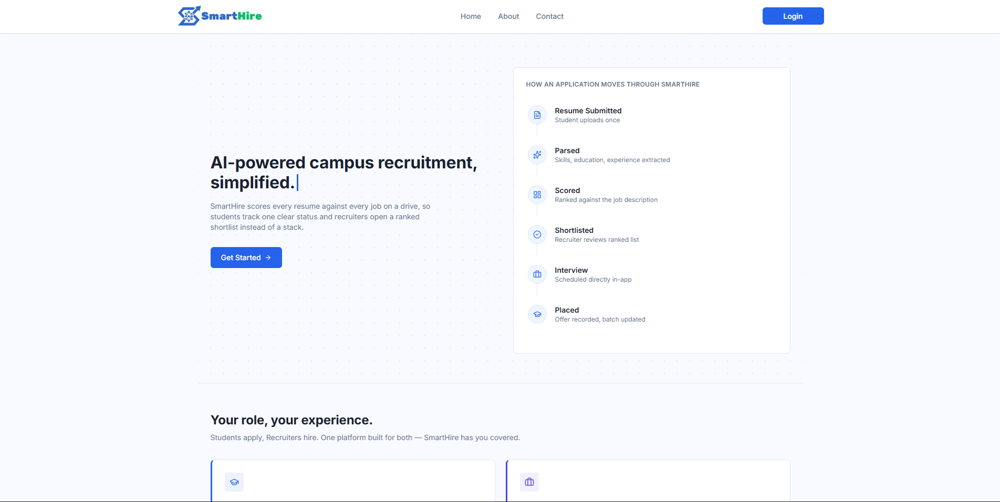

d

  

#  AI-Assisted Campus Recruitment Portal 

---

---

## 📖 About

SmartHire is a web application that streamlines the campus recruitment process. It allows students to apply for job drives, recruiters to manage applications, and administrators to oversee the placement process. The system also includes AI-assisted resume scoring to help recruiters shortlist candidates more efficiently.

---

## ⚡ Built With

---

## ✨ Features

<table>
<tr>
<td width="50%">

### 👤 For Students
- 🔐 Registration & Login
- 📄 Resume Upload
- 💼 Job Application
- 📅 Interview Scheduling
- 📧 Email Notifications

</td>
<td width="50%">

### 🏢 For Recruiters
- 🔐 Registration & Login
- 📝 Job Posting
- 🤖 AI Resume Scoring
- 📅 Interview Scheduling
- 📊 Applicant Tracking

</td>
</tr>
<tr>
<td colspan="2" align="center">

### 🛠️ For Admins

📈 Placement Analytics Dashboard &nbsp;•&nbsp; 👥 User Management &nbsp;•&nbsp; ✅ Approval & Moderation

</td>
</tr>
</table>

---

## 👥 Authors

| Name | GitHub | Email |
|---|---|---|
| Jit Hazra | [@Jit-codes-ez](https://github.com/Jit-codes-ez) |  |
| Saini Paul | [@Saini-Codes](https://github.com/Saini-Codes) |  |

---

## 📬 Contact

⭐ If you like this project, consider giving it a star!
