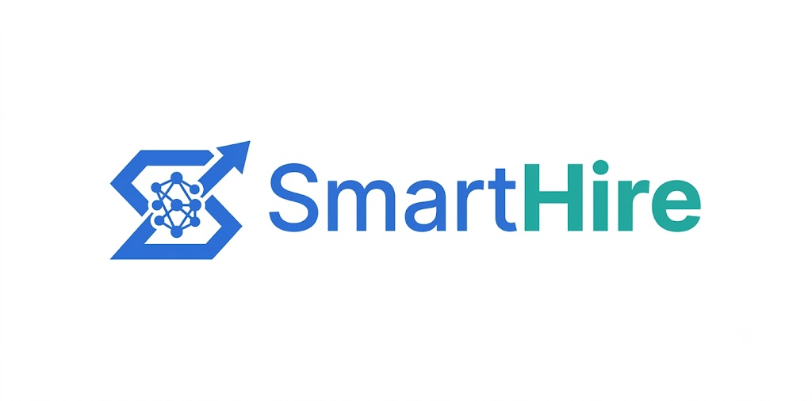

  

<h1 align="center">SmartHire</h1>

  AI-Assisted Campus Recruitment Portal

  Connecting Students • Recruiters • Colleges with AI

---
# 🚀 SmartHire

AI-Assisted Campus Recruitment Portal built using **React**, **Spring Boot**, and **MySQL**.

## 📖 About

SmartHire is a web application that streamlines the campus recruitment process. It allows students to apply for job drives, recruiters to manage applications, and administrators to oversee the placement process. The system also includes AI-assisted resume scoring to help recruiters shortlist candidates more efficiently.

## ✨ Features

- Student Registration & Login
- Recruiter Registration
- Admin Dashboard
- Job Posting & Application
- Resume Upload
- AI Resume Scoring
- Interview Scheduling
- Email Notifications
- Placement Analytics

## 🛠️ Tech Stack

**Frontend**
- React
- Vite
- Tailwind CSS

**Backend**
- Spring Boot
- Spring Security
- Spring Data JPA

**Database**
- MySQL

## 📂 Project Status

🚧 **Under Development**

## 📌 Planned Features

- JWT Authentication
- Resume Parsing
- AI-Based Candidate Ranking
- Recruiter Approval System
- Role-Based Dashboards
- Email Verification
- Placement Statistics

## 👨‍💻 Author

**Jit Hazra, Saini Paul, Sreejani & Susmita**

---

⭐ If you like this project, consider giving it a star!
